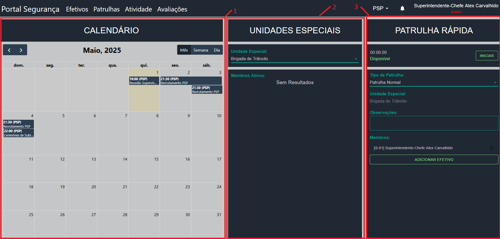

# 📘 Guia para a _Dashboard_

Esta secção explicará todos os pontos importantes da Dashboard. 
A Dashboard é a página inicial da aplicação e tem as funcionalidades mais usadas.

Em todo o local da Aplicação, está presente a Barra de Navegação no topo da página. Para mais informações sobre a funcionalidade da Barra de Navegação, consulta [TBD]

---

## 📸

### 🔢 Anotações

| #     | Descrição                                                                                                                                                                                                                                                                                                                                                                                                               |
|-------|-------------------------------------------------------------------------------------------------------------------------------------------------------------------------------------------------------------------------------------------------------------------------------------------------------------------------------------------------------------------------------------------------------------------------|
| **1** | **Calendário**: O calendário mostra todos os passados e futuros eventos da força atual e outras forças que possam atuar em conjunto com a força atual. - Para verificar os detalhes de um evento, carrega no "cartão" desse evento - Para mais informações verificar [TBD]   - Para criar um novo evento, carrega num espaço vazio no dia em que o evento irá ter lugar - Para mais informações verificar [TBD] |
| **2** | **Unidades Especiais**: A secção das Unidades Especiais mostra todos os efetivos pertencentes à Unidade Especial selecionada que se encontram, de momento, com Patrulha registada na Aplicação.                                                                                                                                                                                                                         |
| **3** | **Patrulha Rápida**: Componente cuja funcionalidade é registar patrulhas de modo fácil e rápido. Basta selecionar o tipo de patrulha e os Efetivos lá presentes e carregar no botão "Iniciar". Quando a patrulha tiver terminada, carregar no botão "Terminar" que irá substituir o botão "Iniciar"                                                                                                                     |
